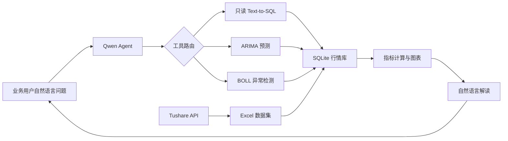

# 证券 ChatBI 助手

面向证券业务场景的对话式商业智能应用。业务用户用自然语言提问，系统自动完成数据采集、SQL 查询、指标计算、自然语言解读和图表可视化，让不熟悉 SQL 的用户也能自助分析行情数据。

本项目由原型主版本 `stock_query_assistant-4.py` 重构而来，面向 AI 应用开发岗位作品集进行工程化整理。

> 本项目用于 AI 应用与数据分析技术展示，不构成投资建议。

## 项目亮点

- **自然语言查数**：使用 Qwen Agent 将业务问题转换为 SQLite 查询。
- **端到端 ChatBI 链路**：数据采集 → Text-to-SQL → 指标计算 → 业务解读 → 图表输出。
- **自动可视化**：小结果集使用柱状图，趋势型结果使用折线图。
- **时间序列分析**：基于 ARIMA(5,1,5) 提供历史序列预测演示。
- **异常检测**：使用 20 日 BOLL 布林带检测上下轨突破。
- **RAG 口径补充**：通过 FAQ 知识文件补充涨跌幅等业务计算口径。
- **安全执行边界**：模型 SQL 经过语句类型检查、只读连接、表白名单、超时和行数限制。
- **工程化交付**：模块化源码、环境变量、离线测试、Ruff 和 GitHub Actions。

## 系统架构



## 演示标的

默认数据采集脚本覆盖：

| 股票 | 代码 |
|---|---|
| 贵州茅台 | 600519.SH |
| 五粮液 | 000858.SZ |
| 上海九百 | 600838.SH |
| 中芯国际 | 688981.SH |

实际数据范围取决于本地数据库最近一次更新时间。

## 技术栈

- Python 3.11
- Qwen Agent / DashScope
- SQLite / pandas
- matplotlib
- statsmodels ARIMA
- Tushare / openpyxl
- pytest / Ruff / GitHub Actions
- 可选：Tavily MCP、Node.js、npx

## 快速开始

### 1. 创建 Python 3.11 环境

```powershell
py -3.11 -m venv .venv
.\.venv\Scripts\Activate.ps1
python -m pip install --upgrade pip
pip install -e ".[dev]"
```

如果只运行应用，也可以使用：

```powershell
pip install -r requirements.txt
```

### 2. 配置环境变量

```powershell
Copy-Item .env.example .env
```

编辑 `.env`，最少填写：

```dotenv
DASHSCOPE_API_KEY=你的_DashScope_API_Key
```

`.env` 已被 Git 忽略，禁止提交真实 Token。

### 3. 准备数据库

方式 A：使用自己的 Tushare Token 重新获取数据。

```powershell
$env:TUSHARE_TOKEN="你的_Tushare_Token"
python scripts/fetch_stock_prices.py
python scripts/import_to_sqlite.py
```

方式 B：本地已有原型数据库时，将其复制到 `data/stock.db`。请先确认数据再分发授权，仓库默认忽略该文件。

### 4. 启动应用

WebUI：

```powershell
python -m chatbi_stock.app --mode web
```

终端模式：

```powershell
python -m chatbi_stock.app --mode cli
```

## 示例问题

- 查询 2025 年全年上海九百的收盘价走势。
- 对比贵州茅台与五粮液 2025 年的涨跌幅。
- 查询中芯国际最近 30 个交易日的成交额走势。
- 使用 ARIMA 预测贵州茅台未来 5 个工作日的价格。
- 检测五粮液过去一年的 BOLL 上下轨突破。

## SQL 安全设计

Text-to-SQL 应用不能只依赖提示词阻止危险 SQL。本项目在执行层实施多重约束：

1. 只接受单条 `SELECT` 或 `WITH ... SELECT`；
2. 拒绝写入、DDL、PRAGMA、ATTACH 和事务控制语句；
3. 数据库以 SQLite `mode=ro` 和 `query_only` 打开；
4. authorizer 只允许访问 `stock_daily_price`；
5. 限制 SQL 长度、执行时间和最大返回行数；
6. 内部查询使用参数化占位符。

## 可选联网搜索

基础 ChatBI 不依赖 Node.js。只有同时满足以下条件时才启用 Tavily：

```dotenv
CHATBI_ENABLE_WEB_SEARCH=true
TAVILY_API_KEY=你的_Tavily_API_Key
```

并确保本机已安装 Node.js 和 `npx`。否则应用自动降级到本地分析模式。

## 测试与代码检查

```powershell
ruff check .
pytest --cov=chatbi_stock
```

测试不调用 DashScope 或 Tushare，不需要真实密钥。

## 项目结构

```text
src/chatbi_stock/       核心应用、Agent、工具与分析算法
scripts/                数据采集与 SQLite 导入入口
data/                   数据库结构；本地数据默认不提交
knowledge/              RAG 业务口径知识
tests/                  SQL 安全、BOLL 和数据导入测试
.github/workflows/      GitHub Actions
```

## 已知限制

- 当前演示数据范围有限，不是全市场行情终端。
- ARIMA 只使用历史价格序列，不包含基本面、新闻或宏观变量。
- 预测日期按工作日生成，未完整排除中国证券市场休市日。
- BOLL 上下轨突破使用简化规则，不代表确定的买卖信号。
- WebUI 默认定位为本地演示；公网部署前还需要鉴权、限流和 HTTPS 代理。

## 数据与许可证

- 源代码使用 [MIT License](LICENSE)。
- 第三方行情数据不自动适用 MIT License，详见 [DATA_LICENSE.md](DATA_LICENSE.md)。
- 风险说明见 [DISCLAIMER.md](DISCLAIMER.md)。
- 安全边界见 [SECURITY.md](SECURITY.md)。

## 后续方向

- 接入中国证券交易日历和预测置信区间；
- 支持用户配置股票池和更多指标；
- 增加 SQL 展示、查询审计和会话级缓存；
- 增加 Docker 与在线演示部署。

